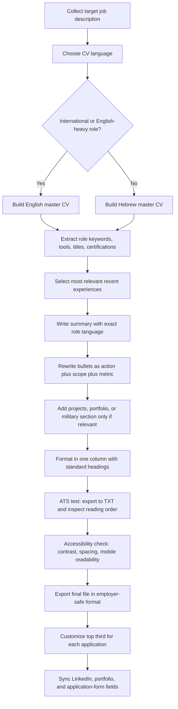

# Israel-Focused Guide to Writing an ATS-Resilient CV That Recruiters Actually Notice

## Executive Summary

For most private-sector jobs in Israel, the strongest default CV is a **clean, one-column, text-first document** in **Hebrew or English depending on the role**, with the **first page carrying the full case for interview selection**: target title, short summary, recent experience, achievements with metrics, relevant skills, and, where appropriate, military or national service translated into civilian value. That structure fits both Israeli recruiter habits and the documented behavior of major ATS platforms such as Greenhouse, Lever, Workday, SAP SuccessFactors, Oracle Taleo, and Spark Hire Recruit formerly Comeet. Israeli job boards and employer pages also show that employers frequently expect bilingual capability, direct relevance, and evidence of execution, not just job descriptions copied from LinkedIn. citeturn34search1turn34search2turn34search16turn24view0turn24view4turn35view0turn23search1

Israel-specific legal and HR context matters. Israeli law prohibits discrimination in hiring on grounds including sex, sexual orientation, personal status, pregnancy and fertility treatment, age, religion, race, nationality, country of origin, political opinion, and reserve duty. Disability law also imposes accommodation duties. In practical CV terms, that means you should usually **omit date of birth, marital status, family status, ID number, photo, religious identity, and reserve-duty details** unless a role or formal state process explicitly requires them. This is doubly important because applicant data is personal information under Israel’s privacy framework, and Israeli official materials treat ID numbers and applicant data as sensitive. citeturn28search0turn19search1turn19search3turn19search24turn27search1turn27search12

The largest avoidable ATS failures are surprisingly mundane: **columns, tables, text boxes, graphics, headers and footers containing contact details, image-based PDFs, unclear headings, and abbreviations that do not match the job description**. Greenhouse explicitly warns that these can break parsing. MIT’s ATS guidance makes the same recommendation in more general terms: boring is better, avoid graphics and text boxes, use common fonts, and use supported file types such as DOCX or PDF unless the employer specifies otherwise. Oracle Taleo similarly documents supported formats, resume parsing, language dependence, and structured extraction of personal, education, and work-history fields. citeturn24view0turn38view0turn24view4

Recent research makes a subtle but important point: older keyword-driven screening systems can reject qualified people because of **semantic mismatch**, not lack of skill. Recent technical studies found that keyword-based screening can produce large false-negative losses when resume wording diverges from job-description wording, while more semantic models reduce that friction. At the same time, newer AI-based resume screening introduces new risks, including measurable prompt-injection abuse in real-world resume corpora. The implication for candidates is simple: **write naturally, but align your wording with the employer’s wording**. Do not keyword-stuff, do not hide text, and do not try to game LLM screeners. citeturn31view0turn31view1turn31view5turn38view0

If your industry is unspecified, the safest strategy is to prepare **two master CVs**: one in English and one in Hebrew, each in a clean ATS-safe format, and then tailor the top third of page one for each application. For international, multinational, hi-tech, and many finance roles, English is often expected or preferred. For local commercial, operational, NGO, and many public-facing roles, Hebrew remains important. For academia and public-sector processes, a “resume” is often not enough by itself: you may need formal CV formats, publication lists, diplomas, teaching statements, certificates, or ID documentation. citeturn16search3turn16search0turn25view10turn11search0turn25view10

## Israel-Specific Legal and Hiring Context

Israeli hiring practice sits inside a legal framework that strongly favors **job-relevant information over personal-status information**. The government’s employment guide states that gender discrimination in hiring is forbidden, and the Equal Employment Opportunities materials also flag discriminatory interview questions about protected characteristics as improper. Separate government guidance specifically notes that employers may not ask candidates about reserve service in interviews, and prospective employers may not ask candidates about fertility treatments. That makes the older local habit of listing personal details more legally awkward than many candidates realize. A modern Israeli CV should therefore emphasize competence, achievements, and fit, not biographical trivia. citeturn28search0turn19search1turn19search3turn19search24

This is especially relevant because some legacy Israeli examples still include information that is no longer strategically wise. AllJobs’ classic hi-tech sample includes city, year of birth, military service, languages, and a recommendations-on-request line. That sample remains useful as a picture of **local structure**, but not as a perfect modern template. The better reading today is to preserve the strong parts, namely the linear structure and skills-to-experience flow, while dropping the low-value or sensitive parts such as year of birth. LinkedIn Recruiter now even offers features that hide candidate names and photos to reduce unconscious bias, which reinforces the case for not adding a photo to a standard CV unless the role explicitly calls for one. citeturn12search0turn39search1

From a privacy standpoint, a CV should be treated as a controlled data disclosure document. The Israel Privacy Protection Authority’s opinion states that a personal ID number is data that can enable identification, and the Bank of Israel’s privacy policy treats ID number as personal information protected under Israeli privacy law. Spark Hire Recruit’s candidate privacy notice shows how much candidate data a recruiting company may process through ATS platforms, including CV content, LinkedIn URLs, salary expectations, internal evaluations, and even interview recordings. For most private-sector applications, that means **do not volunteer an ID number on the CV**, and think twice before embedding additional personal data that is not essential to evaluating your candidacy. citeturn27search1turn27search12turn32view1

At the same time, Israel has sectors where formality still matters. The Ministry of Foreign Affairs’ service for overseas diplomatic-mission positions asks applicants for an up-to-date CV, academic records, diplomas, certificates, and ID-card materials. Government tenders likewise often require detailed CVs and certificates. So the correct local rule is not “never provide identity or credential documentation,” but rather **provide it when the process formally requires it, and not before**. citeturn11search0turn11search14turn11search11

Israeli job-board guidance also reveals something important about recruiter reading behavior. Drushim says a CV should generally be **one to two pages at most**, readable and professional, without loud colors or excessive graphics. AllJobs repeatedly emphasizes that recruiters spend only seconds or tens of seconds on the first pass and advises candidates to keep all critical information on page one, often within a one-page format if feasible. For unspecified-sector roles, that means you should optimize for the skim first, and depth second. citeturn34search2turn34search4turn34search16turn34search6

A practical default content set for Israel, synthesized from Israeli job boards and current employer forms, is: **name, phone, email, city, LinkedIn, optional GitHub or portfolio, short summary, experience, education, military or national service if relevant, skills, languages, and selected projects**. AllJobs’ CV guide identifies the common Israeli sections as personal details, summary, work experience, education, military service, languages, and computer applications. MIT’s resume guidance overlaps strongly with that but adds portfolio links and projects where relevant. That combination is a good general-purpose Israeli baseline. citeturn34search1turn38view2

## Sector Expectations Across Israeli Employers

### Tech, hi-tech, and startups

Current Israeli tech and scale-up career pages show a strong preference for **technical specificity, measurable ownership, and direct role fit**. Mobileye’s current postings ask for technical degrees, complex product or systems experience, analytical strength, fluency in English and Hebrew for some roles, and the ability to work independently in ambiguous environments. Cato Networks, Riskified, WalkMe, AppsFlyer, Taboola, Fireblocks, WEKA, and MyHeritage all currently advertise roles through major ATS platforms used by Israeli employers, which is itself a strong signal that candidates should expect structured intake, keyword extraction, and recruiter searchability. citeturn29view5turn29view10turn15search6turn15search8turn15search2turn15search1turn15search17turn15search0turn15search14

For Israeli startup and growth-company roles, your CV should foreground **scope and output**, not merely tenure. WalkMe’s Israel-facing Lever jobs explicitly mention AI in parts of hiring, and the company’s form shows the role of Lever in capturing structured candidate data. ClickHouse’s Tel Aviv Greenhouse application accepts standard resume file types and asks for LinkedIn and GitHub, while Sauce’s Tel Aviv Lever application asks not only for LinkedIn, GitHub, and portfolio URLs, but also for structured answers to experience and AI-use questions. In other words, many startup applications now extend beyond the CV itself; your CV should therefore act as the concise narrative backbone that matches the fields you will also fill separately. citeturn35view0turn29view0turn29view1

The strongest tech CVs for Israel therefore usually contain a **role-aligned title**, a short summary using the company’s vocabulary, a recent-experience section with metrics, and a **projects section** when it meaningfully proves hands-on ability. Employer forms in Tel Aviv roles increasingly request GitHub or portfolio links, and design roles may explicitly require a portfolio. If you are a developer, data professional, product person, researcher, or designer, it is no longer enough to say you are “passionate”; you should show repositories, shipped features, incident reductions, revenue effects, model-performance gains, or experimentation outcomes. citeturn22search1turn21search0turn29view1turn25view12

### Finance

Israeli finance postings consistently emphasize **bilingual communication, analytical rigor, domain vocabulary, and attention to detail**. A Tel Aviv Stock Exchange posting asks for a relevant degree, capital-markets experience, planning and execution ability, and excellent Hebrew and English written and verbal communication. Current investment roles on LinkedIn for Israeli firms similarly stress financial statements, valuation, modeling, strong academic background, research skill, and comfort with the Israeli startup ecosystem. citeturn29view6turn8search1turn29view7turn8search3

That means a finance CV for Israel should surface the specific finance lexicon the role uses. If the posting says “valuation,” “financial statements,” “capital market,” “institutional investors,” “Excel,” “PowerPoint,” or “corporate finance,” those words should appear in your bullets where true. A generic “analyst” profile that never names the analytical methods or deliverables will underperform against a CV that says, for example, “built 3-statement operating models,” “prepared IC memos,” or “supported investor presentations for seed to Series B companies.” The goal is not decoration but recognizability. citeturn29view6turn8search1turn29view7turn38view0

### Academia

Academic recruiting in Israel works differently enough that it deserves its own template logic. Hebrew University’s academic job pages require a formal CV prepared according to institutional guidelines, plus a publications list, scientific biography, research proposal, teaching statement, selected publications, and teaching evaluations, depending on the post. In other words, for academia, the “CV” is not a compressed one-page resume. It is a structured scholarly record. citeturn25view10turn9search2turn9search8turn37search3

A candidate targeting both industry and academia in Israel should therefore maintain **two separate master documents**. The academic CV should be full-length and institution-aligned. The industry resume should be concise, accomplishment-focused, and ATS-friendly. Trying to use one hybrid document for both markets usually weakens both. citeturn25view10turn37search11

### Public sector and NGOs

Public-sector and quasi-public hiring in Israel tends to reward **document completeness, credential evidence, and process compliance**. Official state processes can ask not only for a CV but also for diplomas, certificates, academic records, and government ID documentation. That means the CV itself should be plain, formal, chronological, and easy to cross-check against supporting records. citeturn11search0turn11search14turn11search11

NGO and mission-driven hiring adds another dimension: **mission alignment**. Hand in Hand’s fundraising leadership role asks for sector knowledge across North America, Europe, and Israel, native-level English and Hebrew, technology fluency, and a brief cover letter explaining connection to the organization’s mission. United Hatzalah’s finance-integration role likewise stresses bilingual communication, attention to detail, CRM knowledge, and cross-time-zone coordination. In NGO hiring, the CV should still stay factual, but a tightly targeted summary and short cover note often help more than in pure corporate tech recruiting. citeturn30search4turn30search5turn29view9turn16search7

## ATS Mechanics and Optimization

Major ATS platforms do three things that matter directly to your CV: they **parse** the document into structured fields, they **index** it for search and filtering, and they often sit inside a workflow where a recruiter screens every new application at a first review stage. Greenhouse documents this clearly: parse success auto-fills fields, parse failure forces manual entry, and the Application Review stage exists to screen each new applicant. That means your CV must do double duty as both a human sales document and a machine-readable input file. citeturn24view0turn26view1

Israeli employers clearly use a mix of ATS products. Current Israeli jobs appear on **Greenhouse** at ClickHouse, Cato Networks, Riskified, Taboola, WEKA, Fireblocks, and MyHeritage; on **Lever** at WalkMe and Lendbuzz; and on **Workday** through Intel’s Israel careers. Former Comeet, now Spark Hire Recruit, also remains relevant through its candidate-privacy and recruiter platform materials. This is enough to reject the idea that there is one “Israeli ATS format.” The right target is not one vendor, but a document that behaves predictably across the major ones. citeturn29view0turn29view2turn29view3turn15search1turn15search0turn15search17turn15search14turn35view0turn35view1turn23search1turn14search7

Greenhouse gives the clearest public list of what breaks parsing. It warns against oversize files above 2.5 MB, graphics and photos, image-based uploads, complex tables, headers and footers, names and contact details inside headers, footers, or text boxes, column layouts, unclear sections, and incomplete job-title abbreviations such as “Sr. Account Exec” instead of “Senior Account Executive.” MIT’s ATS guidance independently reaches almost the same conclusion, adding that text boxes, tables, icons, and stylized formatting can distort or erase content for an ATS. citeturn24view0turn38view0

Oracle Taleo’s documentation shows the same underlying model from another angle. Taleo can parse personal information, education, and work experience into fields; it supports common file types including Word, TXT, RTF, HTML, PDF, Excel, and ODT; it warns that processing resumes in languages other than the submission language might not be supported; and it treats parsing as a structured extraction step before duplicate checking and filing. That matters for Israeli bilingual candidates because it suggests that mixed-language, mixed-direction documents are more fragile than single-language documents matched to the application language. citeturn24view4

Recent technical research helps explain why “matching the job description” remains practical advice, even when employers use more advanced AI. A recent arXiv study of automated resume screening found that keyword-based ATS baselines reject qualified candidates because of semantic mismatch, and that semantic screening reduces false negatives. Another recent paper argues that rigid automated recruitment systems create labor-market friction by over-rejecting qualified workers. Yet LLM-based screening carries its own vulnerabilities: a 2026 study analyzing nearly 200,000 real-world resumes found hidden prompt injections in roughly 1% of resumes. So your best strategy is neither old-school stuffing nor clever manipulation. It is **semantic clarity plus exact relevance**: use the employer’s canonical terms, but in truthful context. citeturn31view0turn31view1turn31view5

Keyword optimization for Israel therefore has four parts. First, extract the hard skills, titles, tools, certifications, and domain nouns from the posting. Second, mirror the employer’s preferred phrasing without copying full sentences. Third, place the most important terms in **searchable zones**: headline, summary, recent roles, projects, and skills. Fourth, prefer **full, standard job titles and spelled-out terminology** over internal abbreviations. MIT recommends meaningful keyword use, warns against abbreviating relevant keywords, and specifically suggests using the posting’s wording where you have genuinely done the thing described. LinkedIn’s talent blog similarly advises keyword use based on job descriptions and relevant profiles, while warning against empty buzzwords. citeturn38view0turn13search1turn13search17

The safest way to write recruiter-catching bullets is still the simplest: **action verb + scope + method + outcome**. MIT’s action-verbs guidance recommends beginning bullets with verbs that affirm the skill you want the reviewer to see. In practice, a weak bullet like “Responsible for backend services” should become “Built and scaled payment-reconciliation microservices handling 2.1M monthly events, reducing manual finance review time by 38%.” The second version is better for recruiters, better for ATS indexing, and better for interview generation because it creates a concrete follow-up topic. citeturn38view1turn38view0

### Formatting choices and ATS compatibility

| Formatting choice | ATS compatibility | Why |
|---|---|---|
| DOCX or text-based PDF | High | MIT says DOC/DOCX and PDF are usually safe unless the job description specifies otherwise; Greenhouse forms commonly accept standard text document types; Taleo supports common office formats and PDF. citeturn38view0turn29view0turn24view4 |
| Scanned or image-only PDF | Low | Greenhouse warns that resumes uploaded as images rather than documents can fail parsing. citeturn24view0 |
| One-column layout | High | Greenhouse identifies columned layouts as a parsing risk; MIT warns that formatting can distort ATS reading order. citeturn24view0turn38view0 |
| Two-column layout | Medium to low | A two-column design may still look attractive to humans, but Greenhouse explicitly flags columned layouts, and MIT recommends avoiding complex layouts for ATS use. citeturn24view0turn38view0 |
| Tables | Low | Greenhouse flags complex resumes with tables; MIT recommends avoiding tables for ATS parsing. citeturn24view0turn38view0 |
| Text boxes | Low | Greenhouse warns that names and contact info in text boxes can fail to parse; MIT says avoid text boxes. citeturn24view0turn38view0 |
| Header or footer for contact details | Low | Greenhouse specifically says contact info in headers or footers may not be parsed correctly. citeturn24view0 |
| Standard headings such as Experience, Education, Skills | High | W3C notes that clear headings help users understand organization, and MIT emphasizes common sections that let readers navigate quickly. citeturn26view8turn38view2 |
| Creative headings such as “My Journey” or “What I Bring” | Medium | Better for branding than parsing; they reduce conventional recognizability for both ATS and rushed recruiters compared with standard labels. citeturn26view8turn38view2 |
| Full job titles and spelled-out skills | High | Greenhouse says incomplete titles can misparse; MIT says avoid abbreviating relevant keywords. citeturn24view0turn38view0 |
| Icons, photos, decorative graphics | Low | Greenhouse flags graphics and photos; MIT says avoid graphics, icons, and images in ATS resumes. citeturn24view0turn38view0 |
| Bold used sparingly for hierarchy | High | Drushim recommends readable, professional formatting without excessive graphics, and MIT supports restrained emphasis with common fonts. citeturn34search2turn38view2 |
| Heavy color, infographics, dense design-template styling | Low | Drushim warns against loud colors and excessive graphics; MIT warns that Canva and some builders can create ATS-confounding formatting. citeturn34search2turn38view0 |
| File above 2.5 MB | Medium to low | Greenhouse cannot parse resumes larger than 2.5 MB. citeturn24view0 |

## Design, Localization, Accessibility, and Privacy

From a UI/UX perspective, a good Israeli CV is not “pretty first.” It is **legible first, scannable second, attractive third**. W3C guidance emphasizes that clear headings and labels help users understand what information is present and how it is organized. W3C’s cognitive-accessibility guidance also favors standard layout and visual hierarchy because familiar structure improves comprehension. On a CV, that translates into predictable ordering, consistent section labels, disciplined bolding, and enough whitespace that the eye can separate one evidence block from the next. citeturn26view8turn26view7

Typography and spacing should serve reading speed. Baymard’s usability research puts optimal line length for body text around 50 to 75 characters, and WCAG’s text-spacing guidance recommends maintaining readability under looser spacing, including line height of at least 1.5 times the font size. MIT recommends avoiding fonts below 10 pt and using common, legible typefaces such as Arial, Calibri, Cambria, Georgia, Helvetica, or Times New Roman. For resumes, the practical interpretation is to use a **neutral font, modest line length, generous white space, and no cramped blocks**. citeturn26view5turn36search10turn38view2

Color should be treated as accent, not content. Drushim advises against bright colors and excessive graphics, while WCAG requires minimum contrast for readable text. So if you use color at all, use it only for subtle hierarchy, not to carry meaning. A recruiter printing in grayscale or viewing on a dim phone screen should still get the document instantly. Black or near-black text on white with a restrained accent color is the safest visual range. citeturn34search2turn17search9turn17search3

For mobile viewing and accessibility, single-column logic matters. Adobe Reader notes that PDF reflow presents text as a single column and makes documents easier to read on mobile devices. Adobe also states that tagged PDFs and correct reading order are essential for accessibility, and InDesign’s current guidance says reading order determines how screen readers and reflowable formats present content. That means a CV that is visually clever but logically scrambled is not only less accessible, it is also more likely to underperform in ATS parsing and on recruiter phones. citeturn25view15turn26view3turn26view4turn26view2

Localization is one of the biggest Israel-specific decisions. Drushim states that English CVs are appropriate for international companies and roles requiring strong English, and its guidance says English CVs commonly use the order of personal details, summary, education, detailed work experience, military experience if relevant, skills, and languages. AllJobs likewise recommends English CVs when aiming at global companies or hi-tech. For many Israeli private-sector roles, sending both a Hebrew and an English version is better than sending one mixed bilingual document. That last recommendation is an inference from job-board language expectations plus ATS parsing realities, but it is the safer operational choice. citeturn16search3turn16search0turn34search15turn24view4turn24view0

Bilingual and right-to-left issues deserve special caution. Because ATS parsers behave most predictably on linear text, the safest Hebrew CV is usually a **fully Hebrew document with English technical terms left in their normal spelling inside a clearly labeled skills list**, not a heavily interleaved Hebrew-English grid. If you need both languages, maintain two versions rather than alternating every section heading. Use one reading direction per line where possible, keep dates consistent, and keep your contact block in plain text at the top of the page, not in a table. This recommendation is a practical inference from Greenhouse’s parse-failure factors, Taleo’s language caveat, and Adobe’s reading-order requirements. citeturn24view0turn24view4turn26view4turn26view2

LinkedIn and portfolio integration should be treated as part of the CV, not an afterthought. LinkedIn’s help pages show that you can add work samples in the Featured section, including external media, documents, and links, and that this section exists to showcase work you are proud of as evidence of your skills and experience. Many Israel-facing employer forms now ask for LinkedIn, GitHub, and portfolio URLs directly. Your CV should therefore include only links that are current, recruiter-safe, and consistent with the claims in the document. citeturn25view12turn25view14turn29view0turn29view1

Privacy settings on LinkedIn deserve active management. LinkedIn says that Open to Work can increase discoverability in recruiter search results, but it also states that complete privacy from your current employer cannot be guaranteed. LinkedIn also states that recruiters do not get access to your full resume unless you provide it directly, including by applying for a job, and that resume-sharing data can be toggled separately. In Israel’s relatively small professional market, this matters. If you are conducting a confidential search, use the recruiter-only setting, audit your shared-resume settings, and assume that no platform gives perfect secrecy. citeturn25view13turn32view2turn32view3

Finally, digital safety is part of CV hygiene. Mobileye’s careers site explicitly warns candidates to apply only through its jobs page and says it will never ask applicants to send money or buy equipment. Job seekers in Israel should adopt that standard universally: do not send identity documents, ID numbers, salary slips, or financial information to unofficial recruiters until you have verified the employer and the channel. citeturn32view0turn27search12

### Layout mockup for an ATS-first one-page CV

```text
┌───────────────────────────────────────────────────────────────┐
│ FULL NAME                              Tel Aviv / Jerusalem  │
│ Target Title                           phone | email         │
│ LinkedIn | GitHub | Portfolio                              │
├───────────────────────────────────────────────────────────────┤
│ PROFESSIONAL SUMMARY                                           │
│ 2–4 lines: role fit, years of experience, top domain terms,   │
│ strongest measurable strengths                                 │
├───────────────────────────────────────────────────────────────┤
│ EXPERIENCE                                                     │
│ Company | Role | Dates                                         │
│ • Action + scope + method + metric                             │
│ • Action + stakeholder + outcome                               │
│                                                                │
│ Company | Role | Dates                                         │
│ • Action + tool + impact                                       │
├───────────────────────────────────────────────────────────────┤
│ PROJECTS OR SELECTED ACHIEVEMENTS                              │
│ • Project name | stack | result                                │
├───────────────────────────────────────────────────────────────┤
│ EDUCATION                                                      │
│ Degree | Institution | Year                                    │
├───────────────────────────────────────────────────────────────┤
│ MILITARY / NATIONAL SERVICE                                    │
│ One or two lines only if relevant                              │
├───────────────────────────────────────────────────────────────┤
│ SKILLS                                                         │
│ Technologies | Methods | Certifications | Languages            │
└───────────────────────────────────────────────────────────────┘
```

This layout keeps every critical element in a predictable scanning order, avoids parser-hostile containers, and preserves the first-page skim advantage emphasized by Israeli job boards. citeturn34search16turn24view0turn38view0

### Layout mockup for a recruiter-friendly two-page CV

```text
PAGE ONE
┌───────────────────────────────────────────────────────────────┐
│ FULL NAME | Target Title | contact links                      │
│ Summary                                                       │
│ Experience: most recent and most relevant roles only          │
│ Key achievements / projects                                   │
└───────────────────────────────────────────────────────────────┘

PAGE TWO
┌───────────────────────────────────────────────────────────────┐
│ Earlier experience                                             │
│ Education                                                      │
│ Certifications / Publications / Patents / Conferences          │
│ Military / National Service                                    │
│ Languages / Tools / Volunteer leadership                       │
└───────────────────────────────────────────────────────────────┘
```

For experienced candidates in English-language multinational roles, a second page is acceptable if page one already carries the reason to interview you. Israeli job-board guidance allows up to two pages, but still stresses readability and first-page importance. citeturn34search2turn16search1turn34search16

## Sample CVs and Templates

Israeli examples suggest three distinct template families. Commercial examples from AllJobs and Drushim emphasize concise sections, military service, languages, and software or skills. English-role examples expand slightly and are more tolerant of two pages. Academic examples from Hebrew University require formal CVs tied to institutional guidelines plus publications and research documents. The strongest modern Israeli commercial CV usually borrows the **clarity and section order** from those examples, while modernizing away from overexposed personal data. citeturn12search0turn12search1turn34search1turn16search3turn25view10

### Annotated English sample CV

```text
NOA LEVI
Senior Product Operations Manager
Tel Aviv | +972-5X-XXX-XXXX | noa.levi@email.com
LinkedIn | Portfolio

SUMMARY
Product and operations leader with 7 years of experience in SaaS and marketplace environments.
Built cross-functional operating rhythms for product, support, and go-to-market teams.
Strong in SQL, experimentation, KPI design, process automation, and stakeholder alignment across Hebrew- and English-speaking teams.

EXPERIENCE
FintechCo, Tel Aviv
Senior Product Operations Manager | 2023–Present
• Built a company-wide product KPI framework across activation, retention, and support quality, improving executive visibility and reducing weekly reporting time by 65%.
• Led rollout of AI-assisted support triage with Product, CX, and Data teams, cutting first-response time by 28% while maintaining CSAT above 92%.
• Designed quarterly planning workflow used by 5 product squads and 3 business units, reducing roadmap slippage by 19%.

ScaleUp Ltd., Herzliya
Product Operations Manager | 2020–2023
• Launched onboarding optimization project spanning 14 funnel experiments, lifting trial-to-paid conversion from 8.7% to 11.4%.
• Created SQL-based self-serve dashboards for Product and Revenue teams, replacing manual exports and saving roughly 12 team-hours per week.
• Partnered with Marketing and Sales to standardize customer feedback taxonomy across 3 systems.

SELECTED PROJECTS
Revenue Leak Audit
• Mapped lifecycle drop-offs across CRM, billing, and support data; identified 3 leakage points worth approximately ₪1.2M annualized upside.

Internal Knowledge Base Rebuild
• Re-architected information taxonomy and ownership model; article findability improved from 61% to 87% in internal testing.

EDUCATION
B.A. Economics and Management, Tel Aviv University | 2019

MILITARY SERVICE
Operations Officer, IDF | 2017–2019
• Coordinated multi-stakeholder operational planning in high-pressure environments.

SKILLS
Product Ops, SQL, Excel, Looker, Amplitude, HubSpot, Jira, KPI Design, Process Automation, Experimentation

LANGUAGES
Hebrew (native), English (fluent)
```

Why this sample works: the headline mirrors a searchable target role; the summary uses role nouns that can match recruiter searches; experience bullets lead with action verbs and quantify outcomes; projects add interview hooks; the military section is brief and civilianized; and personal data is minimized to what is operationally useful. That aligns with Israeli section conventions while staying parse-safe for common ATS platforms. citeturn34search1turn38view1turn38view0turn24view0

### Annotated Hebrew sample CV

```text
נועה לוי
מנהלת אופרציה מוצרית בכירה
תל אביב | 05X-XXX-XXXX | noa.levi@email.com
LinkedIn | Portfolio

תקציר מקצועי
מנהלת אופרציה ומוצר עם 7 שנות ניסיון בסביבות SaaS ומרקטפלייס.
מנוסה בבניית תהליכי עבודה חוצי-ארגון, הגדרת KPI, אוטומציה, עבודה עם SQL
ושיתוף פעולה עם ממשקים דוברי עברית ואנגלית.

ניסיון מקצועי
FintechCo | תל אביב
מנהלת אופרציה מוצרית בכירה | 2023–היום
• בניתי מסגרת KPI רוחבית למוצר, לשירות ול-GTM, שקיצרה את זמן הדיווח השבועי ב-65%.
• הובלתי הטמעת ניתוב פניות מבוסס AI עם צוותי מוצר, דאטה ושירות, והפחתתי את זמן התגובה הראשוני ב-28%.
• יצרתי תהליך תכנון רבעוני ל-5 צוותי מוצר ו-3 יחידות עסקיות, שהקטין חריגות בלוחות זמנים ב-19%.

ScaleUp Ltd. | הרצליה
מנהלת אופרציה מוצרית | 2020–2023
• הובלתי 14 ניסויי Funnel שהעלו המרה מטרייל לתשלום מ-8.7% ל-11.4%.
• הקמתי דשבורדים בשירות עצמי לצוותי מוצר והכנסות, שחסכו כ-12 שעות עבודה שבועיות.
• יישרתי טקסונומיית פידבק לקוחות בין 3 מערכות ארגוניות.

פרויקטים נבחרים
ביקורת דליפת הכנסות
• מיפיתי נקודות Drop-off בין CRM, Billing ו-Support וזיהיתי פוטנציאל שיפור שנתי של כ-₪1.2M.

השכלה
B.A. בכלכלה וניהול | אוניברסיטת תל אביב | 2019

שירות צבאי
קצינת מבצעים | צה"ל | 2017–2019
• תיאום תכנון רב-ממשקי בסביבה דינמית ולחוצה.

מיומנויות
SQL, Excel, Looker, Amplitude, Jira, HubSpot, KPI, אוטומציה, ניסויים

שפות
עברית שפת אם | אנגלית שוטפת
```

Why this sample works in the Israeli market: it uses the familiar local section order, keeps English technical terms where they are likely to be recognized by recruiters and systems, and avoids old-style personal data such as birth year, marital status, and ID number. It is also effectively one-direction-per-line, which is safer for mixed Hebrew-English readability. citeturn34search1turn16search3turn24view0turn24view4

### One-page template

```text
FULL NAME
Target job title
City | phone | email | LinkedIn | GitHub/Portfolio

SUMMARY
2–4 lines:
• Years of experience + sector
• Core strengths + top tools
• One sentence on the value you create

EXPERIENCE
Company | Role | Dates
• Action + method + metric
• Action + stakeholder + outcome

Company | Role | Dates
• Action + method + metric
• Action + tool + result

PROJECTS or SELECTED ACHIEVEMENTS
• Project / deliverable / business result

EDUCATION
Degree | Institution | Year

MILITARY / NATIONAL SERVICE
Only if relevant or still expected for your level

SKILLS
Hard skills | tools | certifications

LANGUAGES
Hebrew | English | other
```

### Two-page template

```text
PAGE ONE
FULL NAME
Target job title
City | phone | email | LinkedIn | GitHub/Portfolio

SUMMARY

EXPERIENCE
Most recent role
Previous role
Previous role

SELECTED ACHIEVEMENTS
2–4 bullets

PAGE TWO
EARLIER EXPERIENCE

EDUCATION

CERTIFICATIONS / LICENSES

PROJECTS / PUBLICATIONS / TALKS
Choose what matches the role

MILITARY / NATIONAL SERVICE
Translate to civilian value

LANGUAGES

OPTIONAL
Volunteer leadership | patents | awards | affiliations
```

## Workflow and Checklist

The safest CV-creation workflow for Israel is shown below. It assumes no specific sector, but includes decision points for language choice, ATS-fit, and sector add-ons.



### Practical step-by-step checklist

1. **Decide the primary language before you write.** If the company is international, the hiring manager is abroad, or the posting explicitly asks for English, use English. If the role is locally oriented and Hebrew-facing, use Hebrew. If you need both, maintain two separate master CVs rather than one interleaved bilingual document. citeturn16search3turn16search0turn24view4

2. **Copy the job description into a working note and highlight** required titles, hard skills, systems, certifications, stakeholder words, and measurable outcomes. MIT explicitly recommends meaningful use of the posting’s keywords, and LinkedIn’s talent guidance calls job descriptions and relevant profiles good keyword sources. citeturn38view0turn13search1

3. **Choose a single target title** and place it under your name. Do not make the recruiter infer your direction from a vague headline. This helps both recruiter skim and ATS indexing. citeturn38view0turn26view8

4. **Write a summary of no more than 2 to 4 lines** using the employer’s vocabulary. Mention years of experience, domain, two or three core strengths, and one concrete differentiator. Hidden meaning is useless in ATS screening; explicit meaning is searchable. citeturn31view0turn38view0

5. **Select only the experiences that support the target role.** AllJobs says irrelevant experience can hurt, and Israeli recruiters skim quickly. If you are applying to multiple job families, keep separate tailored versions. citeturn34search10turn34search16

6. **Rewrite every bullet in achievement form.** Start with an action verb, name the scope or method, and end with an outcome or metric where possible. MIT’s action-verb guide and ATS guidance both support this style. citeturn38view1turn38view0

7. **Use full job titles and full skill names.** Greenhouse warns that abbreviated job titles can misparse, and MIT says relevant keywords should not be abbreviated if that hurts matching. citeturn24view0turn38view0

8. **Add a projects section if it proves fit better than another job bullet would.** This is especially effective in Israeli tech, product, data, and design roles, where forms often ask for GitHub, LinkedIn, or portfolio links directly. citeturn29view0turn29view1turn21search0

9. **Keep the layout one-column and text-first.** Avoid tables, text boxes, icons, banners, charts, photos, and header-footer contact blocks. This is the single most reliable formatting rule across parsers. citeturn24view0turn38view0

10. **Use standard section names.** Experience, Education, Skills, Languages, Projects, Military Service, Certifications, Publications. Clear labels improve scanability and make ATS grouping easier. citeturn26view8turn34search1turn38view2

11. **Remove sensitive or low-value personal data by default.** No photo, birth year, marital status, ID number, religion, reserve-duty disclosure, or salary expectation unless specifically required in the formal process. Israeli law and privacy practice both support this restraint. Many ATS forms already ask location, sponsorship, and salary separately. citeturn28search0turn19search3turn27search1turn29view1turn32view1

12. **Test the CV before sending.** MIT recommends saving to plain text and inspecting what disappears or scrambles. If the TXT export loses contact info or reorders content, the PDF or DOCX is not safe enough yet. citeturn38view0

13. **Check mobile readability.** If the CV requires horizontal scrolling, tiny text, or zoom to understand page one, revise it. Adobe’s reflow guidance favors single-column readability on smaller screens. citeturn25view15turn26view4

14. **Sync LinkedIn and external links.** LinkedIn allows Featured work samples, and many applications import or compare LinkedIn data. Mismatch between CV, LinkedIn, and portfolio is unnecessary friction. citeturn25view12turn25view14turn29view1

15. **For public-sector or academic applications, build the full document pack.** Resume logic is not enough if the process requires certificates, publications, statements, or ID materials. citeturn11search0turn25view10

### Common mistakes that reliably reduce response rates

The most common Israeli-market mistakes are not mysterious. They are sending one generic file to every role, burying the value proposition below half a page of context, using decorative templates that break parsing, mixing Hebrew and English chaotically in columns or tables, listing responsibilities with no outcomes, keeping outdated or irrelevant experience that dilutes fit, and including personal data that adds legal risk without helping selection. Israeli job boards, MIT’s ATS guidance, and Greenhouse’s parser documentation all point in the same direction: **clarity, relevance, and plain structure win more often than creativity-for-its-own-sake**. citeturn34search2turn34search10turn24view0turn38view0

A newer mistake is trying to manipulate automated systems with hidden text, white-font keywords, or prompt-injection tricks. Greenhouse already documents problems with fake or malformed data, MIT warns against falsification and stuffing, and current research shows that LLM-based resume screening is now publicly studied as an attack surface. The high-probability result is not advantage but mistrust, parsing noise, or outright rejection. citeturn24view0turn38view0turn31view5

The final modern mistake is forgetting that recruiters increasingly review candidates across connected tools, not just attachments. Greenhouse has mobile review; LinkedIn controls how your career interests and resume data are exposed; and employer application forms often request LinkedIn, GitHub, or portfolio URLs. A CV that looks polished but leads to an empty, stale, or contradictory digital footprint is weaker than a simpler CV backed by consistent evidence online. citeturn26view0turn25view13turn32view2turn32view3turn29view0turn29view1